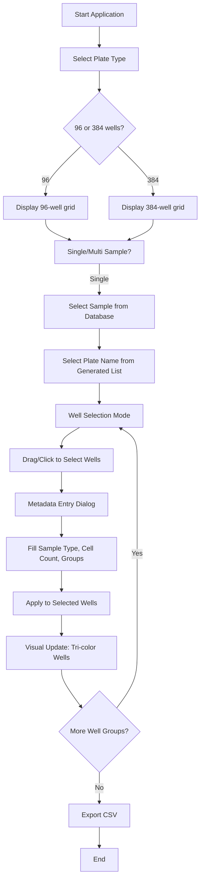
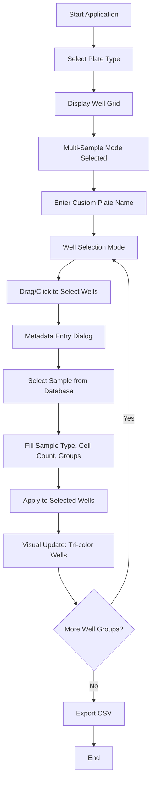
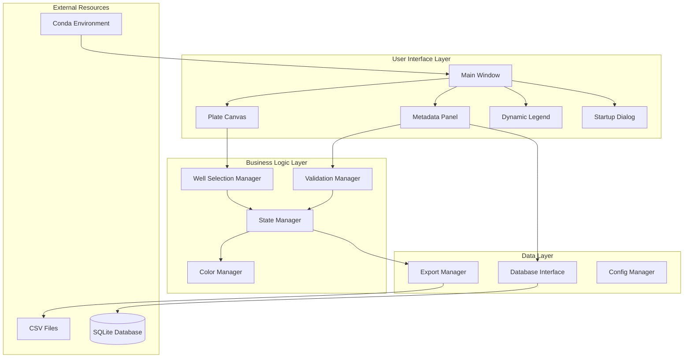
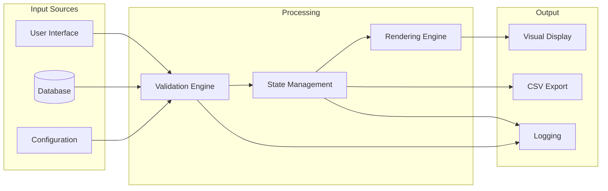
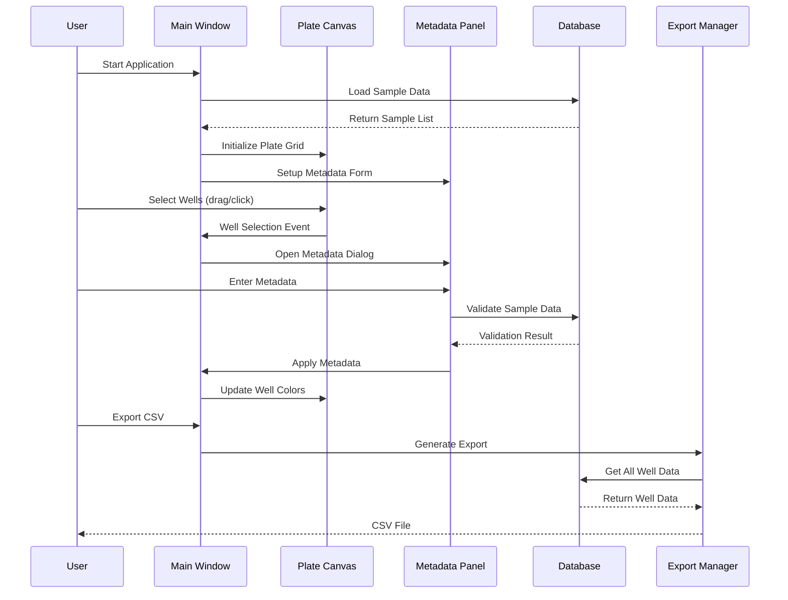
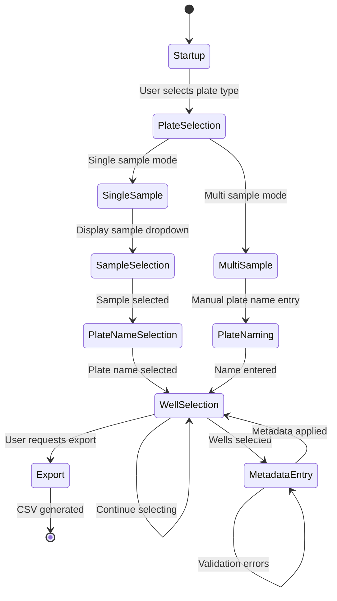
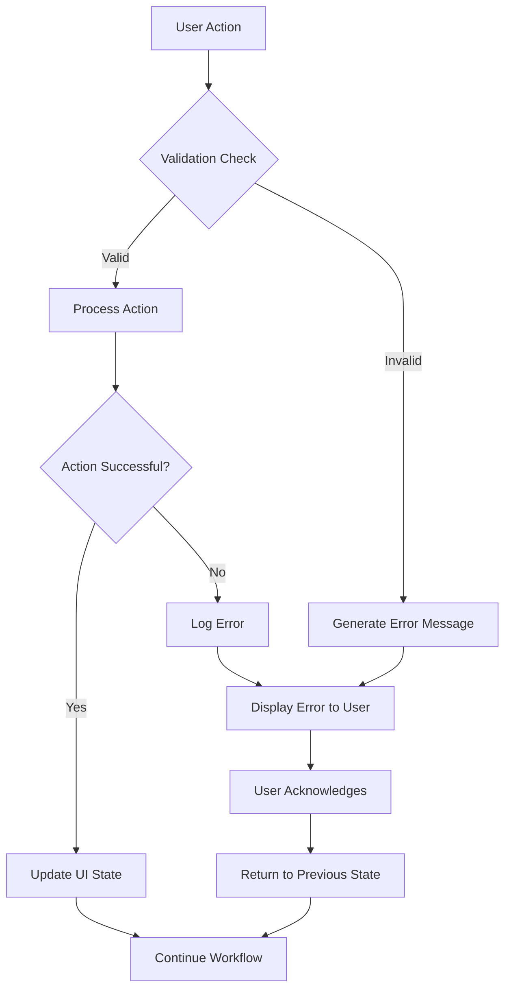
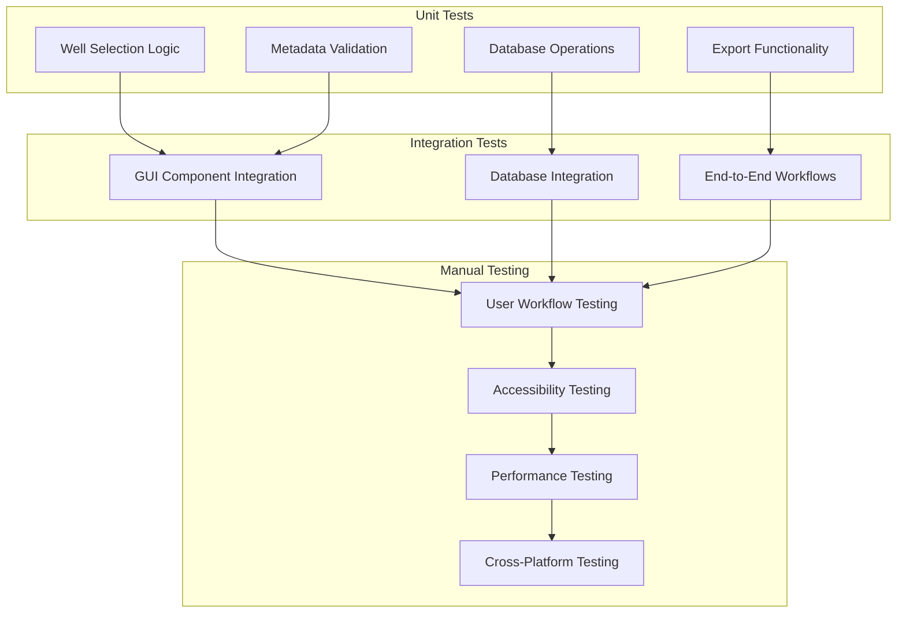
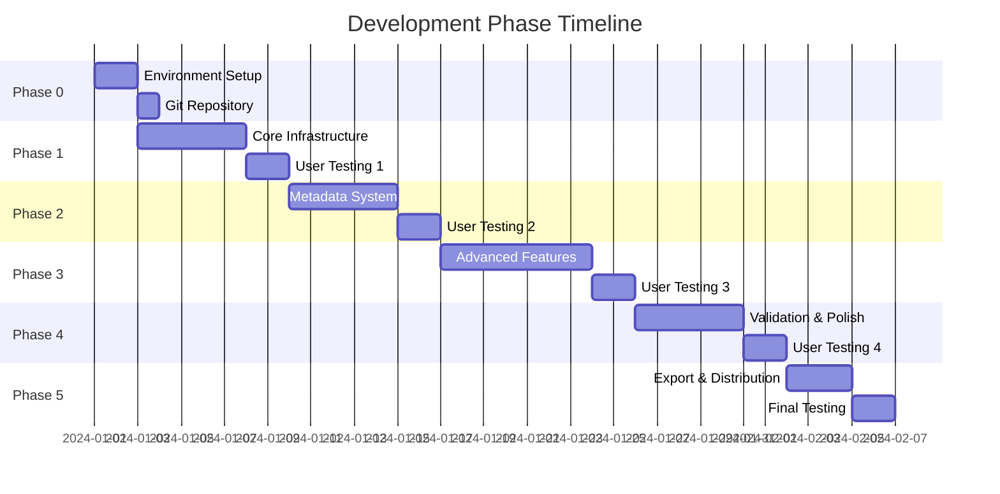

# Workflow Diagrams and Technical Requirements

## User Workflow Diagrams

### Single Sample Workflow (Primary)

### Multi-Sample Workflow (Alternative)

## Technical Architecture Diagram

## Data Flow Diagram

## Component Interaction Diagram

## State Management Diagram

## Error Handling Flow

## Testing Strategy Diagram

## Development Phase Dependencies

## Technical Requirements Matrix

### Performance Requirements

| Component | Requirement | Measurement | Target |
|-----------|-------------|-------------|---------|
| Canvas Rendering | Well grid display time | Time to render all wells | < 500ms for 384 wells |
| Database Loading | Sample data load time | Time to populate dropdowns | < 200ms |
| Well Selection | Selection response time | Time from click to visual feedback | < 100ms |
| Export Generation | CSV creation time | Time to generate complete CSV | < 1 second |
| Memory Usage | Application memory footprint | RAM usage during operation | < 100MB |

### Compatibility Requirements

| Platform | Python Version | GUI Framework | Database |
|----------|----------------|---------------|----------|
| macOS 10.15+ | 3.9+ | Tkinter 8.6+ | SQLite 3.35+ |
| Windows 10+ | 3.9+ | Tkinter 8.6+ | SQLite 3.35+ |
| Linux (Ubuntu 20.04+) | 3.9+ | Tkinter 8.6+ | SQLite 3.35+ |

### Accessibility Requirements

| Feature | Implementation | Testing Method |
|---------|----------------|----------------|
| Colorblind Support | Patterns + Colors | Manual testing with colorblind users |
| High Contrast | Alternative color schemes | Automated contrast ratio testing |
| Keyboard Navigation | Tab order and shortcuts | Manual keyboard-only testing |
| Screen Reader | Proper widget labeling | Testing with screen reader software |

### Data Validation Requirements

| Validation Rule | Implementation | Error Handling |
|-----------------|----------------|----------------|
| Group 1 Exclusivity | Real-time conflict detection | Highlight conflicts, suggest resolution |
| Required Fields | Form validation before apply | Disable apply button, show missing fields |
| Data Types | Input validation and conversion | Show format requirements, auto-correct |
| Database Integrity | Foreign key validation | Graceful fallback to manual entry |

## Context7 Integration Points

### Required Context7 Queries by Development Phase

#### Phase 0: Environment Setup
- "Python conda environment best practices and dependency management"
- "Git repository setup and GitHub integration workflows"
- "Python project structure and packaging standards"

#### Phase 1: Core Infrastructure
- "Tkinter application architecture patterns and main window setup"
- "Tkinter Canvas widget for interactive grid layouts and mouse events"
- "SQLite database integration patterns in Python applications"

#### Phase 2: Metadata System
- "Tkinter form widgets and layout management best practices"
- "ttk.Combobox dynamic value updates and event handling"
- "Python data validation patterns and error handling"

#### Phase 3: Advanced Features
- "Tkinter Canvas drawing methods for colored shapes and patterns"
- "Mouse event handling and selection algorithms in Tkinter"
- "GUI state management and component synchronization"

#### Phase 4: Validation & Polish
- "Python validation frameworks and comprehensive error handling"
- "GUI accessibility patterns for colorblind and keyboard users"
- "Performance optimization techniques for Tkinter applications"

#### Phase 5: Export & Distribution
- "Python CSV writing and file handling best practices"
- "Conda package creation and distribution workflows"
- "Cross-platform Python application deployment"

### Context7 Documentation Requirements

Each implementation must include:
- Context7 query used for research
- Relevant code examples from Context7 responses
- Adaptation notes for project-specific requirements
- Performance considerations from Context7 recommendations

This comprehensive workflow documentation ensures all team members understand the complete development process, technical requirements, and quality standards for the microwell plate GUI project.